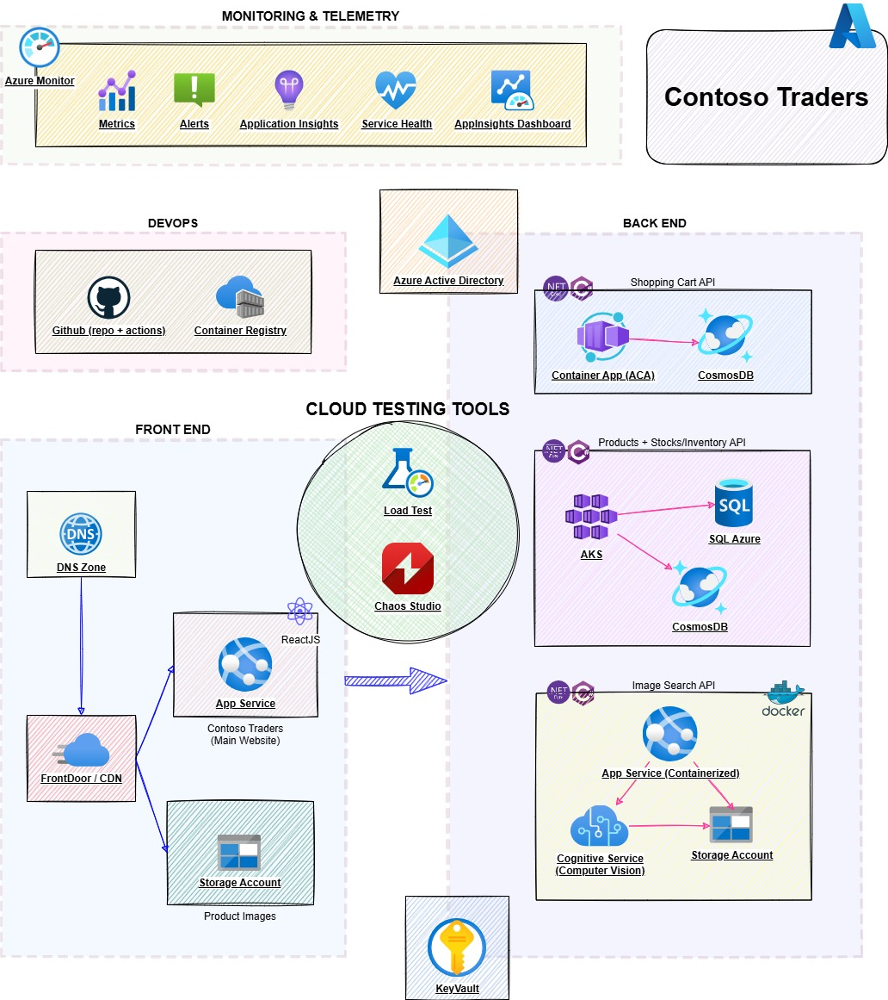

# Contoso Traders - Cloud testing tools demo app

> [!WARNING]  
> The content of this repository is based on [contosotraders-cloudtesting](https://github.com/microsoft/contosotraders-cloudtesting) and has been modified to focus its instructions in Github and Azure Chaos Studio experiments.

The Contoso Traders app is a sample application showcasing [Azure Load Testing](https://aka.ms/malt-docs), [Azure Chaos Studio](https://aka.ms/CHAOS-docs) and more.

This repo contains the source code, deployment templates, and demo scripts for exploring these cloud testing tools.

## Overview Video

> [!WARNING]
> The following overview video explains the purpose and high-level deployment steps. Note that the Playwright section has been removed from this repository, so you may omit that section when following this repository.

## Documentation and Resources

* The following link will showcase the steps needed to deploy the Contoso Trader application into an Azure Subscription

[Deployment Instructions](./docs/deployment-instructions.md)

## Continuous Integration

| Pipeline                                                                     | Status                                                                                                                                                                                                                                                                               | Details                                                        |
| ---------------------------------------------------------------------------- | ------------------------------------------------------------------------------------------------------------------------------------------------------------------------------------------------------------------------------------------------------------------------------------ | -------------------------------------------------------------- |
| [GitHub Workflow](./.github/workflows/contoso-traders-cloud-testing.yml)     |  | Deploys to [production](https://production.contosotraders.com) |

## Demo Scripts

* [Developer Workflow](./demo-scripts/dev-workflow/walkthrough.md)

* Azure Load Testing - Generate high-scale load and identify performance bottlenecks.
  * [Create a load test for the shopping cart API.](./demo-scripts/azure-load-testing/walkthrough.md)
  * [Use GitHub Actions for regression testing.](./demo-scripts/azure-load-testing/walkthrough.md#walkthrough-regression-testing-with-github-workflows)
  * [Create a load test for a private endpoint that’s behind a VNet.](./demo-scripts/azure-load-testing/private-endpoints.md)
  * [Right-size your AKS cluster using load tests.](./demo-scripts/azure-load-testing/aks-cost-optimization.md)

* Azure Chaos Studio - Improve application resilience by introducing faults and simulating outages.
  * [Create an experiment using Key Vault Deny Access fault to test the products API (AKS).](./demo-scripts/azure-chaos-studio/walkthrough.md)
  * [Run experiment in GitHub Actions to inject faults (pod failures) into the AKS cluster.](./demo-scripts/azure-chaos-studio/walkthrough.md#walkthrough-running-chaos-experiments-via-github-workflows)

## Architecture

## Contributing

This project welcomes contributions and suggestions.  Most contributions require you to agree to a
Contributor License Agreement (CLA) declaring that you have the right to, and actually do, grant us
the rights to use your contribution. For details, visit <https://cla.opensource.microsoft.com>.

When you submit a pull request, a CLA bot will automatically determine whether you need to provide
a CLA and decorate the PR appropriately (e.g., status check, comment). Simply follow the instructions
provided by the bot. You will only need to do this once across all repos using our CLA.

This project has adopted the [Microsoft Open Source Code of Conduct](https://opensource.microsoft.com/codeofconduct/).
For more information see the [Code of Conduct FAQ](https://opensource.microsoft.com/codeofconduct/faq/) or
contact [opencode@microsoft.com](mailto:opencode@microsoft.com) with any additional questions or comments.

## Trademarks

This project may contain trademarks or logos for projects, products, or services. Authorized use of Microsoft
trademarks or logos is subject to and must follow [Microsoft's Trademark & Brand Guidelines](https://www.microsoft.com/legal/intellectualproperty/trademarks/usage/general).
Use of Microsoft trademarks or logos in modified versions of this project must not cause confusion or imply Microsoft sponsorship.
Any use of third-party trademarks or logos are subject to those third-party's policies.
